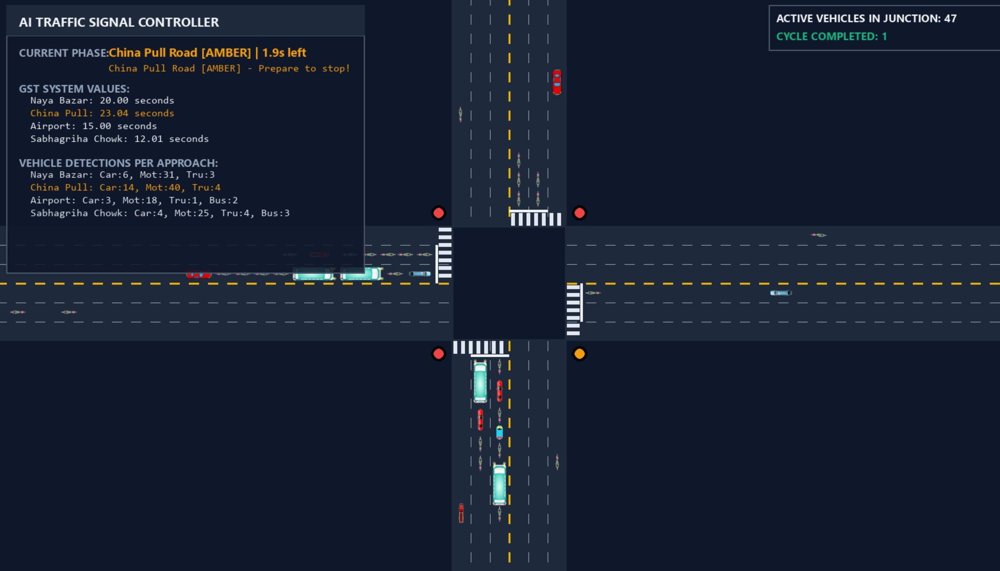
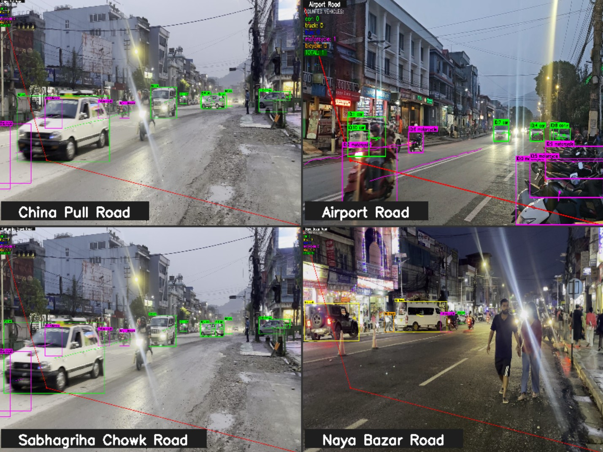
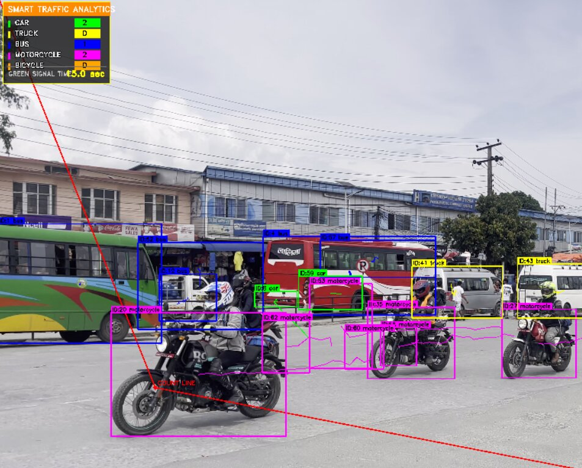
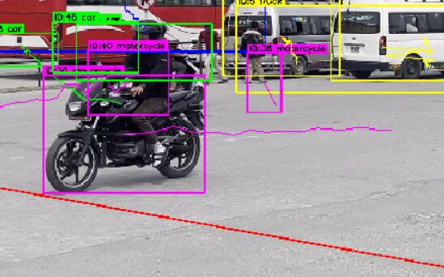

# Real-Time Adaptive Traffic Control System — Prithivi Chowk, Pokhara

A computer-vision-based adaptive traffic signal control system purpose-built for **Prithivi Chowk**, the highest-traffic intersection in **Pokhara, Nepal**. This project is specific to this single intersection — all four approaches (China Pull Road, Airport Road, Sabhagriha Chowk Road, Naya Bazar Road) are modeled with their real lane counts, vehicle patterns, and Nepal-specific traffic rules.

The system uses YOLOv8s object detection and centroid tracking to extract vehicle counts from on-site video footage of each approach, then replays the traffic patterns in a high-fidelity PyGame simulation — decoupling slow video processing from real-time simulation. Green Signal Time (GST) is computed dynamically from actual recorded vehicle counts rather than fixed timers.

## Screenshots

| Preview | Description |
|---------|-------------|
|  | **Simulation Interface** — PyGame window showing the 4-way intersection with active traffic, signal lights, and the glassmorphic HUD displaying GST values, vehicle counts per approach, and cycle statistics. |
|  | **Video Processing** — YOLOv8s processing all four approach videos (China Pull, Airport, Sabhagriha, Naya Bazar) simultaneously during timeline extraction. |
|  | **Vehicle Detection** — YOLOv8s detecting and classifying vehicles (car, motorcycle, truck, bus, bicycle) in each video frame. |
|  | **Centroid Tracking** — Vehicle trajectories tracked across frames with centroid-based tracking and counting line crossing logic. |

## Features

- **Offline timeline extraction** — YOLOv8s processes all four approach videos once at its own pace to build a time-stamped vehicle count timeline
- **True real-time replay** — PyGame simulation runs at a locked 60 FPS by reading pre-extracted counts, independent of video processing speed
- **Dynamic GST computation** — Green Signal Time computed from actual cumulative counts at each signal switch, adapting to real traffic demand
- **Signal cycle** — A→B→C→D (China Pull → Airport → Sabhagriha → Naya Bazar) with full GST green + 5 s extra amber
- **PyGame intersection simulation** — High-fidelity visualization with vehicle physics, lane-following, multi-lane intersection, and collision avoidance
- **Nepal free-left rule** — Left-turn lane always open (no stop on red/amber), reflecting Nepal traffic law
- **Results export** — Signal transitions, GST snapshots per cycle, and simulation summary exported to CSV after each run

## Road Configuration

| Road | Name | Video Source | Inbound Lanes | Min GST | Max GST |
|------|------|--------------|---------------|---------|---------|
| A | China Pull Road | `china_pull_main.mp4` | 6 | 15 s | 44 s |
| B | Airport Road | `airport_main.mp4` | 4 | 15 s | 28 s |
| C | Sabhagriha Chowk Road | `sabha_main.mp4` | 4 | 12 s | 44 s |
| D | Naya Bazar Road | `nayabazar_road.mp4` | 4 | 20 s | 27 s |

Vehicle crossing times: motorcycle = 4 s, car = 5 s, bus = 8 s, truck = 9 s, bicycle = 12 s.

## Requirements

- Python 3.11+
- NVIDIA GPU with 4+ GB VRAM recommended for extraction (falls back to CPU/MPS)
- 8+ GB RAM

### Dependencies

```
ultralytics, opencv-python, pygame, numpy, scipy, torch
```

## Setup

```bash
# 1. Create and activate virtual environment
python -m venv venv
.\venv\Scripts\activate      # Windows
source venv/bin/activate     # Linux/macOS

# 2. Install dependencies
pip install -r requirements.txt

# 3. Place video files at project root
#    china_pull_main.mp4, airport_main.mp4, sabha_main.mp4, nayabazar_road.mp4
```

## Usage

### Phase 1 — Extract Timeline (one-time, can be slow)

```bash
python extract_timeline.py
```

Processes all four approach videos with YOLOv8s + CentroidTracker and writes `outputs/traffic_timeline.json` containing cumulative vehicle counts at each processed frame for every road. This step runs at its own speed — it does not need to keep up with real time.

### Phase 2 — Real-Time Simulation

```bash
python main.py
```

Loads the pre-extracted timeline and runs the PyGame simulation at 60 FPS. The simulation clock advances in real time (1 sim second = 1 wall-clock second). Vehicles spawn dynamically to match the recorded counts. GST is computed from the cumulative counts at the moment of each signal switch.

**Phase sequence per road:** GREEN (full GST) → AMBER (5 s extra) → RED.

After closing the simulation window, the following CSV files are written to `outputs/`:

| CSV File | Description |
|----------|-------------|
| `signal_transitions.csv` | Every signal switch with timestamp, road, GST, and vehicle counts |
| `gst_snapshots.csv` | Periodic GST values for all four roads |
| `gst_per_cycle.csv` | GST assigned per road per complete cycle |
| `simulation_summary.csv` | Total simulation time, cycles completed, final GST values |

### Standalone (fallback without timeline)

```bash
python -m simulation.main
```

Uses example fallback data when no timeline file exists.

## Project Structure

```
├── main.py                      # Entry point — loads timeline, runs simulation
├── extract_timeline.py          # Offline YOLO processing -> traffic_timeline.json
├── timeline_replay.py           # Time-based count lookup with wrap-around
├── signal_controller.py         # Dynamic GST signal cycling A->B->C->D
├── gst.py                       # GST formula with vehicle crossing times
├── tracking.py                  # CentroidTracker (Hungarian algorithm)
├── result_exporter.py           # Captures simulation data and exports to CSV
├── images/                      # Screenshots and diagrams
│   ├── simulation.jpg
│   ├── 4video_running_parallel.jpg
│   ├── detection.jpg
│   └── line_tracing.jpg
├── simulation/
│   ├── __init__.py              # Package exports
│   ├── simulation.py            # PyGame simulation orchestrator
│   ├── signals.py               # Visual signal controller
│   ├── vehicle.py               # Vehicle physics, path-following, rendering
│   ├── road.py                  # Multi-lane intersection drawing
│   ├── hud.py                   # Glassmorphic HUD overlay
│   ├── settings.py              # Constants, road names, lane config
│   ├── utils.py                 # Drawing utilities
│   └── assets/                  # Vehicle sprite images (car, truck, bus, etc.)
└── outputs/                     # Generated timeline JSON + CSV exports
```

## Key Design Decisions

- **Location-specific** — Every component is built for Prithivi Chowk's real geometry: 6-lane China Pull approach, 4-lane roads elsewhere, actual approach videos, and recorded traffic patterns.
- **Two-phase architecture** — Video analysis and simulation are fully separated. Extraction runs at its own pace (GPU-bound); simulation runs at true 60 FPS with no lag.
- **Timeline replay** — Cumulative vehicle counts recorded per frame with timestamps. Simulation looks up counts by wall-clock time and spawns vehicles for deltas. Timeline wraps around when it ends, enabling continuous replay.
- **No artificial multipliers** — GST is computed from actual recorded counts (no `count_boost` or artificial inflation). `gst.py` uses `straight_ratio x sum(count x crossing_time) / (lanes + 1)` clamped to `[min_gst, max_gst]`.
- **Amber is extra** — Each road gets full GST seconds of green, followed by 5 additional seconds of amber, then switches to the next road. Amber does not reduce green time.
- **Free-left rule** — Left-turn lane never stops, reflecting Nepal traffic law where left turns are permitted at all times.
- **Count-based spawning** — Every vehicle in the timeline is reproduced in the simulation; vehicle types and counts match the extracted data exactly.

## Controls (Simulation)

| Key | Action |
|-----|--------|
| `D` | Toggle debug mode (shows vehicle bounding boxes and paths) |
| `ESC` | Exit simulation and export results to CSV |

## Architecture

```
Phase 1 (offline, GPU-bound):
  4 MP4 files -> YOLOv8s + CentroidTracker -> traffic_timeline.json

Phase 2 (real-time, 60 FPS):
  traffic_timeline.json -> TimelineReplay -> SignalController -> PyGame Simulation
                              |
                     Vehicle spawn (count deltas)
```
